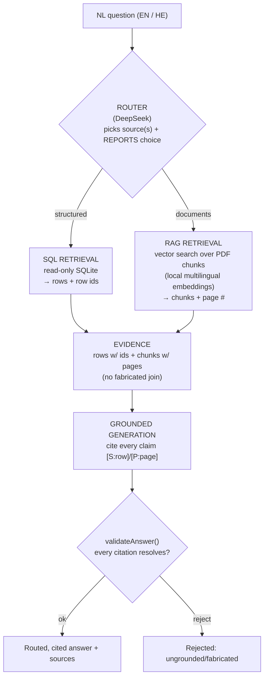

# Aletheia

### AI Business Knowledge Assistant

*Ask a business question in plain language. It routes to the right source, answers with hybrid SQL + document retrieval, and attaches a citation to every fact — one you can trace to the exact database row or document page.*

**[▶ Try the live demo](https://contract-retriever-rag.vercel.app)**  ·  **[View the source](https://github.com/qufeiz/Contract-Retriever-RAG)**

`query routing` · `hybrid SQL + RAG` · `grounded generation` · `source attribution` · `English + Hebrew`

---

> **This is not a PDF chatbot**, and not "upload PDFs into a vector database and do semantic search" — the approach you explicitly ruled out. It is a real **query-routing → hybrid-retrieval → grounded-generation → source-attribution** pipeline, built to extend to your future CRM / email / cloud-storage / case-management sources.

### At a glance

| | |
|---|---|
| **What it does** | Routes each question to the relevant source(s), retrieves with SQL + RAG, returns a cited answer |
| **The differentiator** | Honest grounding — every claim cites a resolvable source, or it says the data doesn't have it |
| **Capabilities** | Contract Intelligence · Case File Q&A · Maintenance Spend Intelligence |
| **Languages** | English + Hebrew (live today) |
| **Stack** | Next.js · DeepSeek · local multilingual embeddings · bundled SQLite + vector index · Vercel |
| **Quality floor** | 40 unit + 13 journey tests (run against the live deploy) · CI-enforced |

---

## How it works

1. **Query routing** — a real LLM decision picks the relevant source(s) and **reports it** in the UI (it's not a hidden heuristic).
2. **Hybrid retrieval** — SQL over your structured data (every row carries a stable id) + RAG over your documents (every chunk carries its page).
3. **Grounded generation** — the answer is composed **only** from retrieved evidence, with an inline citation on every fact.
4. **Source attribution + a content-fidelity gate** — `validateAnswer()` rejects any answer whose citation doesn't resolve to real evidence, so "fluent but ungrounded" can't ship. The two source domains (structured vs. documents) are **never merged on an invented join**.

Full architecture + the data-flow diagram: [architecture.md](architecture.md). Engine internals: [features/shared-engine/reference.md](features/shared-engine/reference.md).

---

## What it can do (three worked capabilities)

Each capability is a real feature with its own golden examples, regression tests, and the screenshots below — all captured from the live demo.

### 1. Contract Intelligence — *expiry, value, and honest about penalties*

Ask *"What contracts expire in the next 90 days and what penalties are defined in those contracts?"* → **38 contracts** expiring, combined annual value **$18,924,883.79**, each row cited — and an **honest statement that penalty terms are not available** (your contract data has no penalty field and no contract documents). It never fabricates a penalty and never pulls from the unrelated case file.

Full guide: [contract-intelligence/user-guide.md](features/contract-intelligence/user-guide.md).

### 2. Case File Q&A — *page-cited findings, corroboration, and surfaced conflicts*

Ask *"What was the final child support amount, and who got primary residence?"* → **$1,285/month** + **primary residence to Joni Carter**, cited to **Page 24 (Final Judgment)**. Ask about the grounds → **corroborated across both documents**. Ask the filing date → it **surfaces the conflict** (the cover sheet says 10 Feb, the narratives say 3 Feb) instead of silently picking one.

Full guide: [case-file-qa/user-guide.md](features/case-file-qa/user-guide.md).

### 3. Maintenance Spend Intelligence — *cited spend, and honest refusal over fiction*

Ask *"How much did we spend on maintenance in 2026, and which vendors cost the most?"* → **$13,485.66 across 248 tickets** (2026), **$40,597.00 all-time**, top vendors cited and drillable. Ask the literal *"which customers have overdue payments and what does the agreement say about suspension?"* → it **honestly refuses**: this data has no payment-status field and no service agreement, so it explains why and **pivots to the spend analysis it can do** — rather than inventing an overdue list.

Full guide: [maintenance-spend-intelligence/user-guide.md](features/maintenance-spend-intelligence/user-guide.md).

---

## The trust property (why this isn't naive RAG)

The single thing that distinguishes a real knowledge assistant from "PDFs in a vector DB" is that it is **honest about what it doesn't know**. This MVP makes that a *tested guarantee*, not a hope:

- **Every factual claim cites a resolvable source** (a SQLite row id or a PDF page). An answer that makes an uncited claim is **rejected** by `validateAnswer()`.
- **It states absence instead of fabricating** — no penalty data → "not available"; no payment-status field → "I can't determine overdue payments, and here's why"; a source conflict → both values surfaced, not silently resolved.
- **It never invents a join** between unrelated sources (your school operations data and the Carter case file share no key — they're composed and cited separately, never merged).

These behaviors are enforced as **red automated tests** (per-feature content-fidelity gates + journey tests that run against the live deployment), not described in prose.

---

## Data Quality Assessment

> **This is a selling point, not a footnote.** Your stated fear is naive work — "someone who simply uploads PDFs into a vector database and performs semantic search." The antidote is **source-vetting judgment**: knowing what your data can and cannot honestly answer *before* building. We inspected **all 9 provided sources at the row level**, built features only where a source can ground a real, cited answer, and **deliberately dropped the five that can't** — naming the exact defect for each.

**4 of 9 sources support real, grounded features. 5 were vetted and dropped — for specific, named defects, not for time.**

| # | Source | Verdict | The defect that decides it |
|---|---|---|---|
| 1 | `school data 1.csv` — contracts | ✅ **Built on** | Clean costs/dates → Contract Intelligence. (`Contract ID` actually holds job titles; some End&lt;Start; no penalty column — handled honestly.) |
| 2 | `school data 3.csv` — maintenance | ✅ **Built on** | Clean spend → Maintenance Spend. No payment-status/due-date field → overdue questions honestly refused, not faked. |
| 3 | Family Court Case File (PDF) | ✅ **Built on** | Page-numbered, citable → Case File Q&A (Page-24 Final Judgment). |
| 4 | Carter Story (PDF) | ✅ **Built on** | Corroborating narrative for the case file. |
| 5 | `school data 2.csv` — enrollment | ❌ **Dropped** | `term_name` is 100% a Ruby error string; `status` holds gender values — columns are the **wrong data entirely**. |
| 6 | `school data 4.csv` — payroll | ⚠️ **Deferred** | Pay-method/notes columns are 100% error strings; the headline fields are corrupt. |
| 7 | `school data 6.csv` — payroll (alt) | ⚠️ **Deferred** | `pay_month` ranges 1–100; payment method is a random integer; can't reconcile with #6. |
| 8 | `school data 5.csv` — invoice totals | ❌ **Dropped** | **All 788 rows are identical** (180/6/1080) — zero variance to analyze or cite. |
| 9 | `school data .csv` — person list | ❌ **Out of scope** | Generic directory (incl. PII-shaped fields); no spec question touches it. |

**That discipline *is* the product** — the system says *"I can't answer that from this data"* (the maintenance-overdue and contract-penalty cases) rather than fabricate, applied not just at answer time but at **data-intake time**.

📄 **Full row-level evidence — [docs/product/data-quality-assessment.md](product/data-quality-assessment.md)** (every source, the exact defect, and what clean re-supply would un-block).

---

## Extensible by design

The router + retrieval layer is **source-pluggable**. Your future integrations — CRM, email, cloud storage, case management — each register as a new retrieval source behind the same router contract, **without changing** the grounding/citation/validation layer. The per-fact citation model is what makes per-source access control addable later.

## English + Hebrew

The demo answers in **both English and Hebrew today** (the embedding model is multilingual; citations are preserved across languages). Each feature's guide includes a Hebrew golden example. RTL UI polish and Hebrew-tuned prompts are the natural next step — the architecture is already ready for them.

---

## Stack

Next.js · DeepSeek (`deepseek-chat`) for routing + generation · local `Xenova/multilingual-e5-small` embeddings (no embeddings key; the Hebrew seam) · bundled read-only SQLite + an in-app vector index · deployed on Vercel. Self-contained and reproducible (`npm run build:index` rebuilds the index deterministically from the source data).

**Quality floor:** every push runs CI — doc-lint + doc-structure-lint + typecheck + 40 unit tests; 13 journey tests run against the live deployment. The content-fidelity gates above are part of that floor.
