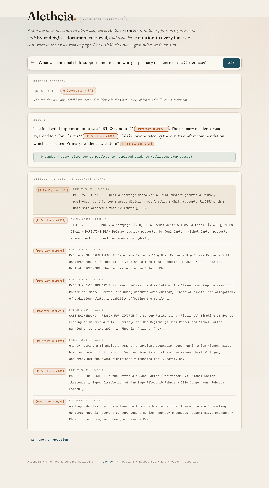
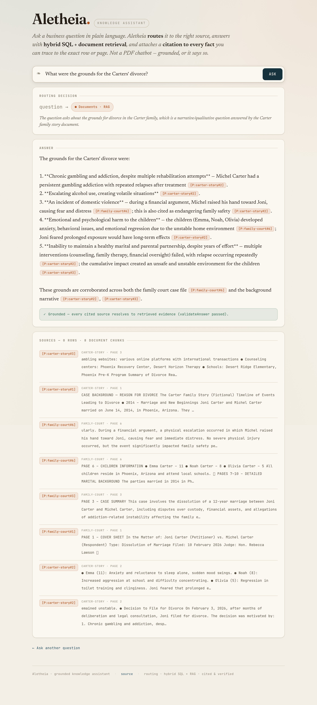
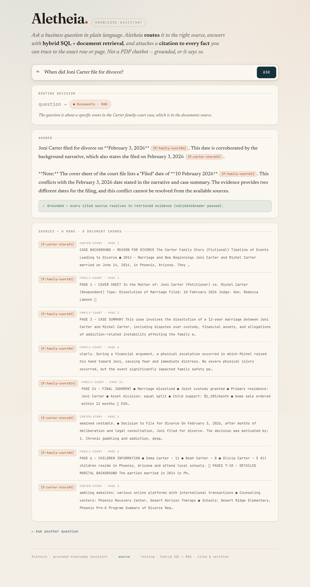
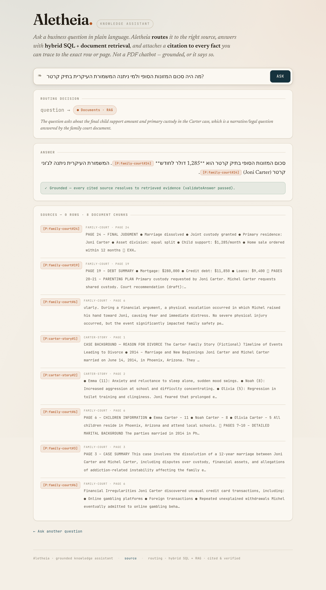

# Case File Q&A — ask questions about the Carter case

> Derived from: 01-design.md (the case Q&A workflow) + 02-examples.md (Examples A–D). This guide gets you page-cited answers to case questions, with corroboration across documents and honest conflict-surfacing.

## Overview

Case File Q&A answers free-form questions about the Carter family-court case by retrieving from the two case PDFs and citing every fact to a **specific document and page**. Reach for it when you need a defensible answer to a legal-document question — a holding, a finding, a date — that a reader can verify by opening the cited page. It corroborates facts across both documents where they agree, **surfaces conflicts** instead of hiding them, and says "not stated in the case file" rather than inventing.



## 1. Ask about the court's decision

Type a question about the case outcome, e.g. *"What was the final child support amount, and who got primary residence in the Carter case?"*

```text
What was the final child support amount, and who got primary residence in the Carter case?
```

## 2. Read the page-cited finding

The answer states the exact finding — **child support of $1,285/month** and **primary residence to Joni Carter** — each cited to **`[P:family-court#24]`** (the Final Judgment, Page 24 of the court case file). Click the citation to verify against the real PDF page.


## 3. Ask a question answered by multiple documents

Ask *"What were the grounds for the Carters' divorce?"* The answer is **corroborated across both documents** — the court case file **and** the narrative story — each cited distinctly, demonstrating multi-document retrieval rather than a single-source lookup.



## 4. See a source conflict surfaced honestly

Ask *"When did Joni Carter file for divorce?"* The documents disagree — the cover sheet says **10 February 2026**, the narratives say **February 3, 2026**. The assistant **surfaces both dates with both citations** and notes the conflict, rather than silently picking one. This is the trust property of a document-QA system.



## 5. Ask in Hebrew

The same Final Judgment question in Hebrew returns the **identical** finding ($1,285/month) and the same **Page-24 citation** — the citation tokens are preserved, not translated.



## Result / Verify

You get exact, page-cited case findings — corroborated across documents where they agree, with conflicts surfaced rather than resolved silently, and "not stated in the case file" for anything the documents don't contain — in English or Hebrew. Click any `[P:doc#page]` citation to confirm it points to the real page.

## Related
- [Shared engine reference](../shared-engine/reference.md) — how document RAG, citation, and validation work.
- [README](README.md) — the screenshot/gate ledger for this feature.
- [Architecture](../../architecture.md) — the system overview.
