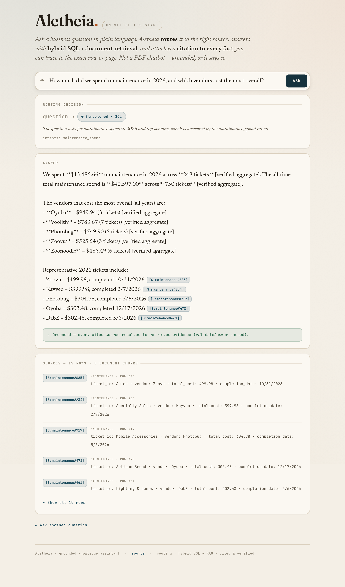
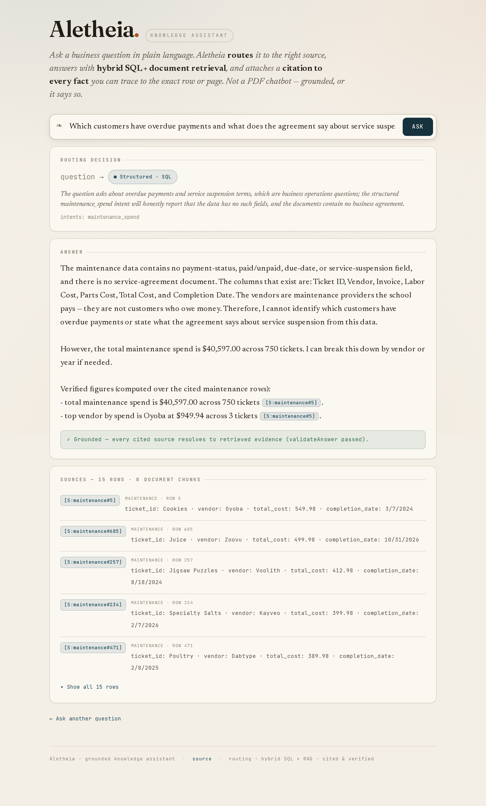
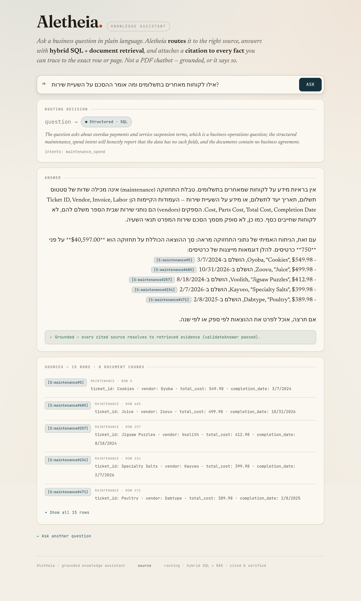

# Maintenance Spend Intelligence — analyze spend and trust the honest answer

> Derived from: 01-design.md (the spend + honest-refusal workflow) + 02-examples.md (Examples A–C). This guide gets you cited spend figures and shows how the assistant honestly refuses a question the data can't answer.

## Overview

Maintenance Spend Intelligence answers free-form questions about maintenance spend — totals, by year, by vendor — over the maintenance data, with every figure cited to the rows that compose it. Reach for it for a defensible spend breakdown. Its defining trait is **honesty about what the data lacks**: asked about overdue payments or service-suspension terms (fields this data doesn't have), it explains why and refuses to invent them — then pivots to the analysis it *can* do. That honesty is the trust property a real system has and a naive "PDFs in a vector DB" does not.



## 1. Ask for a spend breakdown

Ask *"How much did we spend on maintenance in 2026, and which vendors cost the most overall?"*

```text
How much did we spend on maintenance in 2026, and which vendors cost the most overall?
```

## 2. Read the cited spend figures

The answer gives the **2026 total ($13,485.66 across 248 tickets)**, the **all-time total ($40,597.00 across 750 tickets)**, and the **top vendors** (Oyoba $949.94, Voolith $783.67, …) — each figure cited to `[S:maintenance#id]` rows you can drill into to verify the sum.


## 3. Ask a question the data can't answer

Ask the literal spec question: *"Which customers have overdue payments and what does the agreement say about service suspension?"* This data has no payment-status field and no service agreement — so this is the honesty test.

```text
Which customers have overdue payments and what does the agreement say about service suspension?
```

## 4. Read the honest refusal

Instead of inventing an overdue list, the assistant explains **why it can't answer** — it names the table's actual columns (Vendor, Invoice, Labor/Parts/Total Cost, Completion Date), notes there is **no payment-status or due-date field** and **no service-agreement document**, and that the vendors are **providers the school pays, not customers who owe**. It then **pivots** to the real spend analysis it can do. No fabricated names, no invented figures.



## 5. Confirm the honesty holds in Hebrew

The same overdue question in Hebrew returns the **same honest refusal** with the same reasoning and the **$40,597.00** pivot figure intact.



## Result / Verify

You get exact, cited, drillable spend figures — and, when you ask for a field the data doesn't have, an honest "not in this data" explanation that cites the real columns and refuses to fabricate, rather than a confident invented answer. That refusal is the feature working as designed, not a gap.

## Related
- [Shared engine reference](../shared-engine/reference.md) — how routing, SQL retrieval, and validation work.
- [README](README.md) — the screenshot/gate ledger for this feature.
- [Architecture](../../architecture.md) — the system overview.
