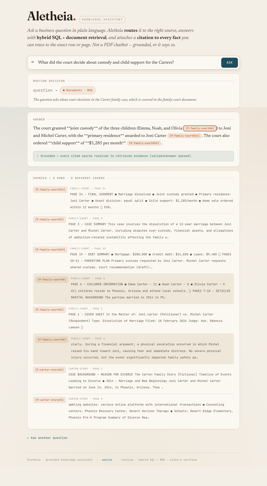

# Shared engine — reference

Derived from: `../../architecture.md` + the running system (`lib/engine/*`, `app/api/ask`).

The **reference** (2am runbook + internals) for the infrastructure every feature is built on: ingestion → routing → hybrid retrieval → grounded generation → citation → `validateAnswer()`. This is shared infrastructure documented **once** here; each domain *feature* (contract-intelligence, receivables-intelligence, case-file-qa, …) builds its query surface on top and owns its own user-facing docs.

The running engine — a document-routed, page-cited, validated answer (the Carter custody/support golden):

## The request loop

`POST /api/ask { question }` → `answerQuestion()` (`lib/engine/answer.ts`):

1. **Route** — `routeQuestion()` (`lib/engine/router.ts`) makes a **real DeepSeek call** that returns JSON: which `sources` (`structured` / `documents`), which structured `intents` + params, and an optional `docFilter`, plus a one-line `rationale`. The UI **reports** this decision (routing is visible, not hidden). The LLM never writes SQL — it selects from a fixed **intent catalog**.
2. **Retrieve** —
   - *SQL side*: each selected intent (`lib/engine/intents.ts`) runs a parameterized `SELECT` against the read-only bundled SQLite. Each row carries its stable `id` → citation `[S:<table>#<id>]`.
   - *RAG side*: the question is embedded with the local multilingual model; `vectorSearch()` cosine-ranks the prebuilt PDF chunks. Each chunk carries its page → citation `[P:<doc>#<page>]`.
3. **Ground** — `generateGrounded()` calls DeepSeek with ONLY the retrieved evidence and instructs an inline citation on every factual claim, copied verbatim from the evidence. The two citation namespaces stay separate (no join).
4. **Validate** — `validateAnswer()` (`lib/engine/validate-answer.ts`, pure) checks every citation token resolves to evidence retrieved this turn and that a factual answer carries ≥1 citation. An honest "not in the available sources" is allowed; a fluent-but-uncited answer or a fabricated citation is **rejected**.

The response carries `route`, `answer`, `evidence` (every cited row/chunk), and `validation` — full traceability.

## Modules

| File | Responsibility |
|---|---|
| `lib/engine/csv.ts` | Zero-dependency CSV parser (quoted fields, embedded commas). |
| `lib/engine/schema.ts` | CSV→table map; malformed-cell detection; `MM/DD/YYYY`→ISO date. |
| `lib/engine/loader.ts` | CSV → SQLite. Quarantines malformed cells (NULL + `__malformed` flag + a `_load_report`); never crashes. |
| `lib/engine/pdf.ts` | `pdftotext` (build-time) → per-page text → overlapping chunks. |
| `lib/engine/embeddings.ts` | Local `Xenova/multilingual-e5-small`; `embedQuery`/`embedPassage` (e5 prefixes) + cosine. |
| `lib/engine/documents.ts` | PDF→`doc` id map; the `VectorIndex` shape. |
| `scripts/build-index.mts` | Rebuilds `data-index/` deterministically (`npm run build:index`). |
| `lib/engine/retrieval.ts` | Read-only SQLite singleton + `sqlSelect` (SELECT-only guard); `vectorSearch`. |
| `lib/engine/intents.ts` | The named structured-query intents the router selects (no LLM SQL). |
| `lib/engine/llm.ts` | DeepSeek client (OpenAI-compatible); key env-only. |
| `lib/engine/router.ts` | The routing decision + plan normalization (safe degrade). |
| `lib/engine/answer.ts` | The orchestrator (route→retrieve→ground→validate). |
| `lib/engine/validate-answer.ts` | The pure content-fidelity gate. |
| `app/api/ask/route.ts` · `app/page.tsx` | API + the ask-box UI (routing panel, cited answer, source panel). |

## The bundled index (generated artifact)

`npm run build:index` rebuilds:
- `data-index/contracts.sqlite` — 7 tables from `data/*.csv` (`contracts`, `maintenance_invoices`, `invoice_volume`, `payroll_v1`, `payroll_v2`, `enrollment`, `people`) + a `_load_report`.
- `data-index/vectors.json` — PDF chunks + local embeddings (model + dim + records).

Both are **gitignored** and rebuilt during `npm run build` (so Vercel regenerates them at deploy time). Don't hand-edit.

## Data quality (honest, not hidden)

Malformed source rows (`error: undefined method ...`) are loaded as NULL with `__malformed=1`. `_load_report` records per-table malformed-cell counts (e.g. `enrollment.term_name` is entirely malformed; `payroll_v1` has ~235). Intents filter `__malformed=0` where correctness depends on it.

## Setup / run / deploy
See [`../../ops/environment.md`](../../ops/environment.md). Required env: `LLM_API_KEY`, `LLM_BASE_URL`, `LLM_MODEL` (DeepSeek). Local: `npm install` → `npm run build:index` → `npm run dev`. Deploy: Vercel env vars + `vercel --prod`; the index rebuilds in the Vercel build.

## Debugging in prod (2am)
- **Answer rejected** (`validation.ok=false`) → the model cited evidence not in `evidence`, or made an uncited claim. Inspect `evidence` in the API response; the model hallucinated a citation or under-retrieved. Tighten the intent or k.
- **Wrong route** → read `route.rationale` + `route.intents`. The router degrades to querying all sources if its JSON is unparseable.
- **Empty structured answer** → the intent matched no rows (e.g. date window). Check `ASSISTANT_TODAY` and the intent's params.
- **PDF citation page looks off** → `[P:doc#page]` is the **physical** pdftotext page; the case file's printed "PAGE N" labels differ from physical pages. The citation still resolves to the exact retrieved chunk.

## Extensibility
A future CRM/email/cloud-storage/case-management source registers as a new retrieval source + intent catalog entry behind the same router contract; the grounding/citation/validation layer is unchanged.
