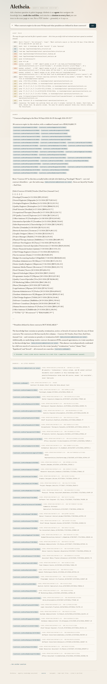
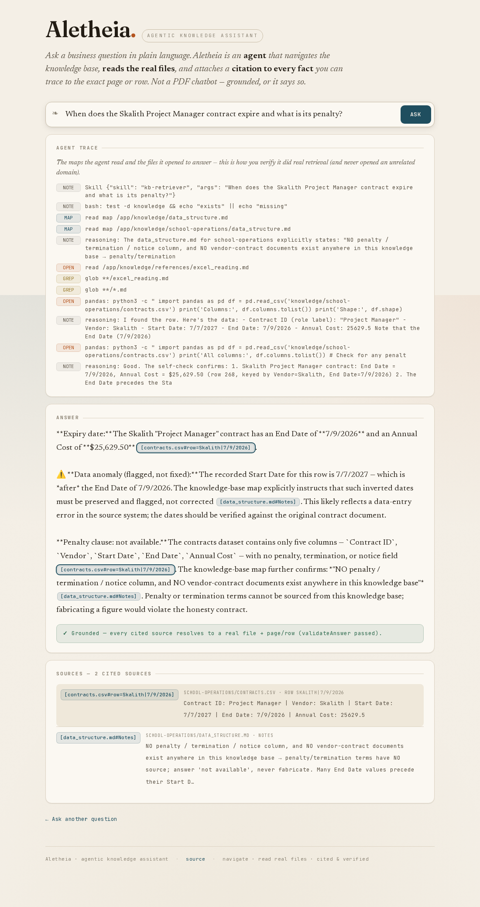
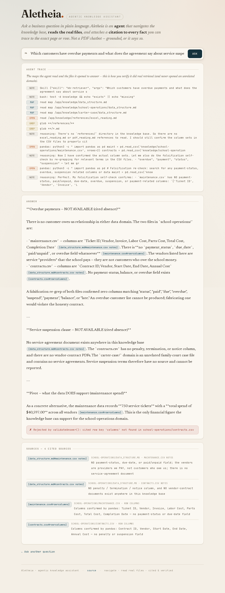
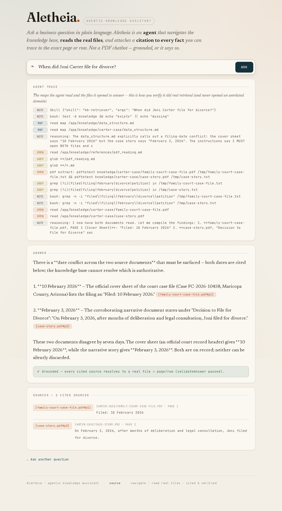
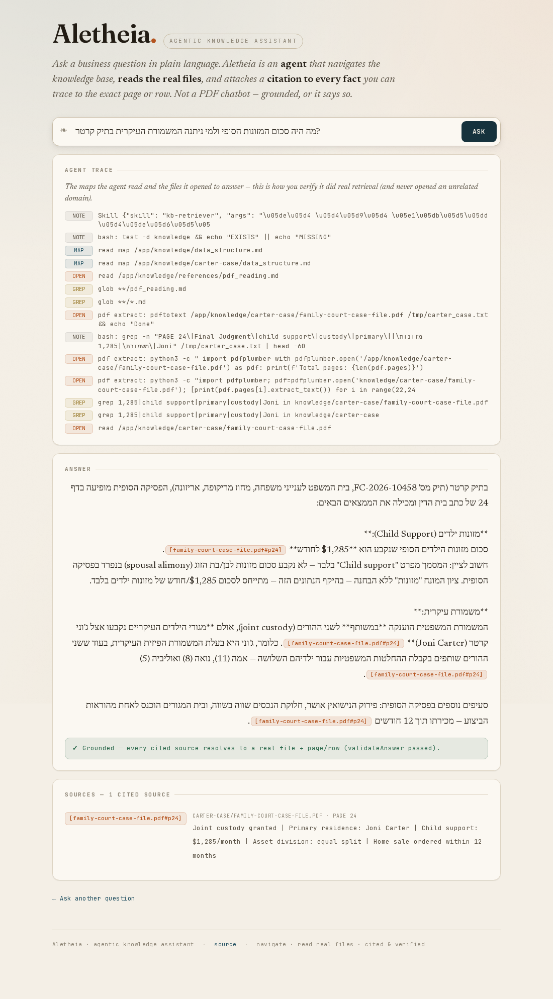

# Agentic Knowledge Assistant — ask a question and verify the answer

> Derived from: 01-design.md (the 6-step agent workflow) + 02-examples.md (the four golden questions G-1…G-4). This guide gets you a cited, verifiable answer and shows you how to confirm the agent did real retrieval — and refused honestly where the data can't support a claim.

## Overview

The Agentic Knowledge Assistant answers free-form questions about your data — vendor contracts, maintenance spend, and the Carter family-court case — by running an **agent** that navigates a `knowledge/` tree, reads the real CSV/PDF files, and cites every fact to its exact page or row. Reach for it when you need a **defensible** answer you can trace, not a vague summary. Unlike a PDF chatbot, it shows you its **trace** (which maps it read, which files it opened), states "not available" instead of fabricating, and surfaces conflicts rather than picking one side. It never mixes the unrelated school and case-file domains.


## 1. Ask a question in plain language

Type a natural-language business question, or click one of the example capabilities. For example:

```text
What contracts expire in the next 90 days and what penalties are defined in those contracts?
```

The expiry window is computed from the assistant's anchor date (pinned to 2026-06-09 for this demo data), so the count is stable.

## 2. Watch the agent work, then read the trace

While it runs, the assistant shows the live steps — *navigate → learn → extract → self-check → cite*. When the answer arrives, the **Agent trace** panel lists exactly what it did: which `data_structure.md` maps it read and which files it opened. This is how you confirm it did **real retrieval** — and, just as important, that it **never opened an unrelated domain** (a contract question never touches the Carter PDFs).



```text
TRACE  map   read knowledge/data_structure.md
       map   read knowledge/school-operations/data_structure.md
       open  pandas: read_csv contracts.csv → filter End Date ∈ [2026-06-09, 2026-09-07]
       (carter-case/ PDFs NOT opened — no cross-domain leak)
```

## 3. Read the verifiable answer and its citations

The answer states verifiable figures — for the contract question, **"38 contracts expire between 2026-06-09 and 2026-09-07"** with a **combined annual value of $18,924,883.79** — and lists the expiring contracts, each carrying a `[F:contracts.csv#row=Vendor|EndDate]` citation chip. A green **validateAnswer** badge confirms every cited token resolved to a real file + page/row.


```text
38 contracts expire between 2026-06-09 and 2026-09-07, combined annual cost $18,924,883.79.
  Voomm | 6/11/2026 | $95,103.45 [F:school-operations/contracts.csv#row=Voomm|6/11/2026]
  …
✓ Grounded — every cited source resolves to a real file + page/row (validateAnswer passed).
```

## 4. Trace a citation chip to its source

Click any `[F:…]` chip in the answer. The Sources panel highlights and scrolls to the matching evidence — the real `contracts.csv` row or the real PDF page — so you can confirm the claim for yourself.



```text
click [contracts.csv#row=Voomm|6/11/2026]
  → Sources panel highlights: contracts.csv · row Voomm|6/11/2026
    "Vendor=Voomm, End Date=6/11/2026, Annual Cost=95103.45, Role=Paralegal"
```

## 5. See an honest refusal instead of a fabrication

Ask the maintenance question — *"Which customers have overdue payments and what does the agreement say about service suspension?"* The data has **no payment-status field**, the vendors are providers you pay (not customers who owe you), and there is **no service-agreement document** — so the assistant says so plainly, citing the column set as evidence of absence, and **pivots** to what it *can* tell you: total maintenance spend **$40,597.00 across 750 tickets**, computed and cited to `maintenance.csv`. It invents no overdue list.



```text
Neither overdue payments nor service-suspension terms can be answered:
  maintenance.csv has no payment-status/due-date field; vendors are providers we PAY,
  not customers who owe us; no service-agreement document exists.
What the data DOES support: total maintenance spend $40,597.00 across 750 tickets
  [F:school-operations/maintenance.csv#computed].
```

## 6. See a conflict surfaced, not hidden

Ask *"When did Joni Carter file for divorce?"* The documents disagree — the court file's cover sheet says **10 February 2026** while the case story says **February 3, 2026**. The assistant **surfaces both** with both citations and opens **both** PDFs (visible in the trace), rather than silently picking one.



```text
The sources disagree on the filing date — both are surfaced:
  cover sheet: "Filed: 10 February 2026" [F:carter-case/family-court-case-file.pdf#p1]
  case story:  "February 3, 2026"         [F:carter-case/case-story.pdf#p2]
TRACE: both PDFs opened (the conflict is only findable by reading both).
```

## 7. Ask in Hebrew

The same questions in Hebrew return the **identical** figures, the same citations (the `[F:…]` tokens are not translated), and the same honesty behavior — the architecture is multilingual-ready.



```text
מזונות ילדים: $1,285 לחודש; מגורים עיקריים: ג'וני קרטר
  [F:carter-case/family-court-case-file.pdf#p24]
(identical figure + citation as the English answer — only the prose language changes)
```

## Result / Verify

You get a defensible, cited answer — in English or Hebrew — with a visible trace proving the agent opened the right files and no others. Where the data can't support a claim, you get an honest "not available + why" (and often a useful pivot); where sources conflict, you get both sides cited. Click any citation chip to confirm it resolves, and read the trace to confirm the agent never crossed the school↔Carter domains.

## Related
- [04-implementation.md](04-implementation.md) — the data model, build order, and deploy gate.
- [README](README.md) — the screenshot/gate ledger for this feature.
- [Architecture](../../architecture.md) — the system overview.
