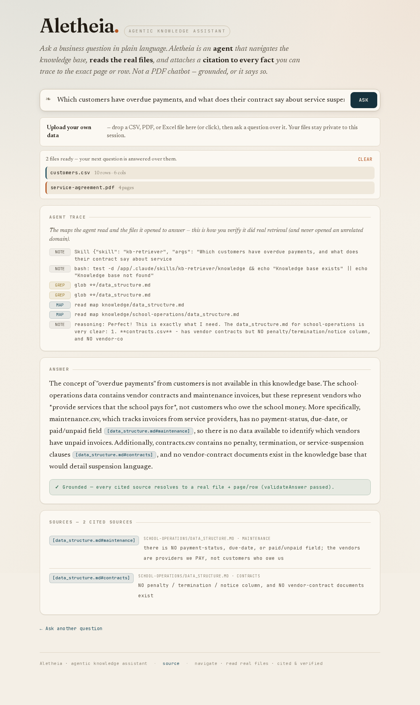

# Live File Upload — ask a grounded question over your own data

> Derived from: [01-design.md](01-design.md) (the upload → per-session, isolated, read-only Q&A workflow) + [02-examples.md](02-examples.md) (the U-1 headline question + the U-2 honest-absence guard). This guide takes you from uploading a CSV + a contract PDF to a cited, verifiable cross-source answer — and shows you how the same honesty and read-only guarantees from the committed demo apply to *your* data.

## Overview

The committed demo answers questions over a fixed knowledge base. **Live upload** lets you bring your **own** files — a customers/overdue CSV, a contract PDF, an Excel sheet — and ask a question over them. The agent reads your uploaded files the same way it reads the built-in corpus: it navigates a map, opens the real files, computes the answer, and cites every fact to the exact **row** or **page** of *your* upload. Your files stay private to your session (another user can't read them), the agent can only **read** them (never run them or reach anything else on the server), and if your files genuinely don't contain what you asked, it says so honestly instead of inventing an answer.

Reach for this when you want a **defensible, cited** answer over data you control — for example: *"Which of my customers are overdue, and what does my contract say about suspending them?"*



## 1. Upload your files

In the demo, drop your files onto the **upload area** (or click it to pick them). Accepted types are **CSV, PDF, and Excel (`.xlsx`)**.

For this walkthrough, upload the two fixtures:
- `customers.csv` — a customers/overdue ledger (`customer, invoice_id, amount_due, invoice_date, due_date, status`).
- `service-agreement.pdf` — a Master Services Agreement whose **§4.3** sets the service-suspension terms.

Once they upload, the area lists each file with what the agent will read — the CSV's **rows and columns**, the PDF's **page count**. (A wrong file type, an oversize file, or a corrupt/encrypted PDF is rejected right here, with a clear message, before you ask anything.)

```text
Uploaded · 2 files ready
  customers.csv           10 rows · 6 cols
  service-agreement.pdf   4 pages
```

## 2. Ask a question that spans both files

Type a question that needs **both** uploaded files:

```text
Which customers have overdue payments, and what does their contract say about service suspension?
```

Your next question automatically carries your upload session, so the agent answers over *your* files (plus the built-in corpus only if relevant) — not anyone else's.

## 3. Watch the agent open your files, then read the trace

While it runs, the live trace shows the agent **navigating your uploads** and opening **both** files — `customers.csv` (with pandas) and the contract (via its pre-extracted text). An answer that consulted only one file would be incomplete; the trace is how you confirm it read both.

```text
TRACE  map   read uploads/<your-session>/data_structure.md
       open  pandas: read_csv customers.csv → filter status=='unpaid' AND due_date < 2026-06-09
       open  read service-agreement.txt → grep "Service Suspension" → §4.3
```

## 4. Read the cross-source answer and its citations

The answer states the verifiable headline — **3 customers, 4 invoices, totalling $18,965.50 overdue** — and lists each overdue invoice cited to its **CSV row**, then quotes the **§4.3 suspension clause** cited to the **contract page**:

```text
3 customers, 4 invoices, $18,965.50 overdue (as of 2026-06-09):
  Northwind Traders  INV-1071  $6,200.00  25 days  [F:customers.csv#row-2]
  Contoso Ltd        INV-1055  $3,175.50  51 days  [F:customers.csv#row-3]
  Contoso Ltd        INV-1088  $1,990.00   8 days  [F:customers.csv#row-4]
  Adatum Corp        INV-1077  $7,600.00  18 days  [F:customers.csv#row-7]

Service suspension: "Provider may suspend Services … if any undisputed Invoice
  remains overdue by more than thirty (30) days," with 7 days' written notice.
  [F:service-agreement.pdf#p3]
```

The CSV facts are cited to **rows**, the clause to a **page** — **separate citations, never merged**. The agent does not invent a relationship between your two files; it correlates them only through the contract's own stated rule.

## 5. See the rule applied to your data — honestly

The answer applies the contract's own **>30-day** threshold to your overdue list and reports that **only Contoso Ltd (INV-1055, 51 days)** currently exceeds it and is suspension-eligible — the others are under 30 days. The comparison is computed (51 > 30), cited to both the rule (`#p3`) and the row (`#row-3`), not asserted. The trap rows in the fixture — a **paid-but-past-due** invoice, an invoice due **exactly today**, and **future-due** invoices — are correctly **excluded** from "overdue".

```text
Suspension-eligible (>30 days overdue, §4.3):
  Contoso Ltd INV-1055 — 51 days > 30  [F:customers.csv#row-3] [F:service-agreement.pdf#p3]
Excluded (not yet overdue): Fabrikam (due today), Wingtip & Litware (future-due), paid invoices
```

## 6. Trace a citation chip to its source

Click any `[F:…]` chip. The Sources panel highlights and scrolls to the matching evidence — the real `customers.csv` row or the real contract page of *your* upload — so you can confirm the claim yourself. A green **validateAnswer** badge confirms every cited token resolved to a real file + page/row in your session.

```text
click [customers.csv#row-3]
  → Sources panel highlights: customers.csv · row 3
    "Contoso Ltd, INV-1055, 3175.50, 2026-03-20, 2026-04-19, unpaid"
✓ Grounded — every cited source resolves to a real file + page/row (validateAnswer passed).
```

## 7. See an honest "not available" when your files lack the answer

Now ask for something your files **don't** contain — for example, upload **only** `customers.csv` (no contract) and ask:

```text
Which customers have overdue payments, and what's the penalty interest rate if they don't pay?
```

The agent lists the overdue customers from your CSV, then says it **can't state a penalty rate — no contract or rate field was uploaded**, citing your CSV's column set as the evidence of absence. It does **not** guess a rate. Upload the contract and the same question becomes answerable — absence is data-dependent, never fabricated.

## Result / Verify

You get a defensible, cross-source answer over **your own** uploaded files — each fact cited to a row or page you can click to confirm — with a visible trace proving the agent opened your files (and only yours). Where your files can't support a claim, you get an honest "not available + why". Your uploads are private to your session, read-only to the agent, and discarded after the session expires.

## Related
- [04-implementation.md](04-implementation.md) — the per-session store, the widened read boundary, the model decision, the security gates.
- [02-examples.md](02-examples.md) — the U-1/U-2 golden bar + the discriminating fixture.
- [01-design.md](01-design.md) — what this feature is and why, and the honesty contract over uploaded data.
- [README](README.md) — the screenshot/gate ledger for this feature.
